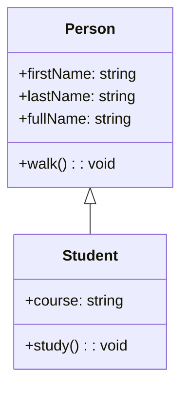

# 👨‍🏫 Inheritance in TypeScript

Inheritance is a core concept in Object-Oriented Programming (OOP) that allows us to reuse common properties and methods across multiple classes. In TypeScript, we achieve this by creating a base class and extending it in derived classes.

This example demonstrates inheritance using a `Person` class and a `Student` class. Let's break it down step-by-step. 

---

## 📋 Table of Contents

- [What is Inheritance?](#what-is-inheritance)
- [Class Definitions](#class-definitions)
  - [Person Class](#person-class)
  - [Student Class](#student-class)
- [Mermaid Diagram](#mermaid-diagram)
- [Example Usage](#example-usage)
- [Code Explanation](#code-explanation)

---

## 🔍 What is Inheritance?
Inheritance allows us to define a base class with common properties and methods that other classes can extend. Derived classes inherit all properties and methods from the base class and can add their own unique properties or override base methods.

---

## 📚 Class Definitions

### Person Class
The `Person` class represents a generic person with the following features:

- **Properties**: `firstName` and `lastName` (both strings).
- **Getter**: `fullName` - Combines `firstName` and `lastName` with a space.
- **Method**: `walk()` - Logs a message that the person is walking.

```typescript
class Person {
    constructor(public firstName: string, public lastName: string) {}

    get fullName() {
        return this.firstName + ' ' + this.lastName;
    }

    walk() {
        console.log(this.fullName + ' is walking');
    }
}
```

### Student Class
The `Student` class extends `Person` and adds the following:

- **Property**: `course` - Represents the course the student is studying.
- **Constructor**: Uses `super` to call the parent `Person` constructor.
- **Method**: `study()` - Logs a message that the student is studying a specific course.

```typescript
class Student extends Person {
    constructor(public firstName: string, public lastName: string, public course: string) {
        super(firstName, lastName);
    }

    study() {
        console.log(this.fullName + ' is studying ' + this.course);
    }
}
```

---

## 🎨 How its Inherit
Here's a diagram illustrating the inheritance relationship between `Person` and `Student`, similar to the provided visual:



---

## 📖 Example Usage

This example shows how we can create a `Student` object and use inherited and unique methods:

```typescript
const student = new Student('John', 'Doe', 'Computer Science');
student.walk();
student.study();
```

### Output:
```plaintext
John Doe is walking
John Doe is studying Computer Science
```

---

## 📝 Code Explanation

1. **Base Class** (`Person`):
   - Properties `firstName` and `lastName` are defined with the `public` access modifier.
   - The `fullName` getter returns the person's full name.
   - The `walk` method logs a walking message.

2. **Derived Class** (`Student`):
   - The `Student` class extends `Person`.
   - The constructor uses `super` to call the parent constructor and initialize `firstName` and `lastName`.
   - A new property `course` is added.
   - The `study` method logs a studying message.

---
