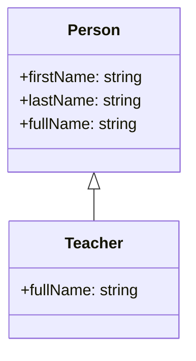

# 🔄 Method Overriding in TypeScript

Method overriding allows derived classes to change the behavior of methods or properties defined in a base class. This is useful when a subclass needs to provide specialized behavior while keeping the original structure intact.

---

## 📋 Table of Contents

- [Method Overriding](#method-overriding)
- [Class Definitions](#class-definitions)
  - [Person Class](#person-class)
  - [Teacher Class](#teacher-class)
- [Mermaid Diagram](#mermaid-diagram)
- [Example Usage](#example-usage)
- [Configuring tsconfig.json](#configuring-tsconfigjson)
- [Code Explanation](#code-explanation)

---

## 🔄 Method Overriding

In TypeScript, method overriding allows us to redefine a method or getter in a derived class. The `override` keyword is used to indicate that a method is being overridden from the base class.

### Why Use the `override` Keyword?
Using the `override` keyword has the following benefits:

- It makes the code more readable and explicit.
- It prevents errors by ensuring the base class has a method with the same name.
- It is enforced when `noImplicitOverride` is enabled in `tsconfig.json`.

---

## 📚 Class Definitions

### Person Class
The `Person` class represents a person with the following features:

- **Properties**: `firstName` and `lastName`.
- **Getter**: `fullName` - Combines `firstName` and `lastName` with a space.

```typescript
class Person {
    constructor(public firstName: string, public lastName: string) {}

    get fullName() {
        return this.firstName + ' ' + this.lastName;
    }
}
```

### Teacher Class
The `Teacher` class extends `Person` and overrides the `fullName` getter to prefix the name with "Teacher":

```typescript
class Teacher extends Person {
    override get fullName() {
        return 'Teacher ' + super.fullName;
    }
}
```

---

## 🎨 Diagram to Understand
Here's a diagram illustrating the inheritance relationship and overridden method:



---

## 📖 Example Usage

This example shows how we can create a `Teacher` object and use the overridden `fullName` method:

```typescript
const teacher = new Teacher('Jane', 'Doe');
console.log(teacher.fullName);
```

### Output:
```plaintext
Teacher Jane Doe
```

---

## 🛠 Configuring tsconfig.json

To enforce the use of the `override` keyword, uncomment the following line in your `tsconfig.json` file:

```json
"noImplicitOverride": true
```

This setting ensures that all overridden methods are explicitly marked with the `override` keyword.

---

## 📝 Code Explanation

1. **Base Class** (`Person`):
   - Defines `firstName` and `lastName` as public properties.
   - The `fullName` getter returns the person's full name.

2. **Derived Class** (`Teacher`):
   - The `Teacher` class extends `Person`.
   - The `fullName` getter is overridden to prefix the name with "Teacher".

Enabling `noImplicitOverride` ensures that any overridden methods are explicitly marked, making the code more robust and easier to understand.

